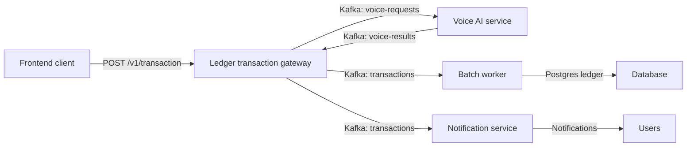

# High-level Overview

An enterprise-grade, event-driven retail microservices platform built around Kafka, resilient AI voice parsing, and a single transaction gateway.

## Project structure

- `client-vite/` - Vite React frontend and voice UX.
- `pkg/` - shared libraries for logging, Kafka messaging, and resilience.
- `services/` - microservices:
  - `ledger-service/` - transaction gateway, Kafka producers, and ledger API.
  - `notification-service/` - Kafka consumer for notification delivery.
  - `batch-worker/` - Kafka consumer for batching ledger persistence.
  - `voice-ai-service/` - Kafka consumer for voice/Gemini processing with circuit breaker.
- `deployments/` - Kubernetes manifests and Traefik ingress configuration.
- `docker-compose.yml` - local runtime with Kafka, Postgres, Redis, Traefik, and services.

## Enterprise architecture and flow



### Core flow

1. Frontend sends all transaction activity to `ledger-service` only.
2. If voice input is included, `ledger-service` publishes a `voice-requests` Kafka event.
3. `voice-ai-service` consumes that event, parses the voice text/audio, and applies Gemini.
4. `voice-ai-service` protects Gemini calls with a local circuit breaker and publishes the parsed result back to `voice-results`.
5. `ledger-service` receives the voice result and creates a transaction event on the `transactions` topic.
6. `batch-worker` persists transactions into Postgres.
7. `notification-service` delivers notifications asynchronously from the same `transactions` stream.

## Why this design

- **Single gateway contract:** frontend only uses `/v1/transaction`, keeping clients simple and stable.
- **True event-driven voice processing:** voice payloads travel through Kafka, avoiding direct HTTP voice service coupling.
- **Resilience at the edge:** the voice service implements a Gemini circuit breaker, preventing external AI failures from impacting the transaction pipeline.
- **Loose coupling:** transaction creation, voice parsing, persistence, and notifications are separated by Kafka topics.
- **Auditability and replay:** Kafka topics provide durable voice and transaction event history for audit and recovery.

## What changed

- `ledger-service` now publishes voice requests to `voice-requests` instead of calling voice endpoints directly.
- `voice-ai-service` now consumes voice requests from Kafka, parses them with Gemini, and responds via `voice-results`.
- `voice-ai-service` includes a Gemini circuit breaker to protect AI calls.
- The frontend continues to call the single transaction gateway at `/v1/transaction`.
- The transaction gateway remains responsible for transaction validation and Kafka event creation.

## Challenges solved

- **Problem:** frontend and gateway were tightly coupled to voice HTTP endpoints.
  - **Decision:** switch voice orchestration to Kafka request/response.
  - **Result:** cleaner service boundaries and better enterprise event flow.

- **Problem:** Gemini failures could disrupt the transaction path.
  - **Decision:** protect the voice service with a circuit breaker and explicit failure responses.
  - **Result:** improved stability and graceful degradation for AI voice parsing.

- **Problem:** multiple services were waiting on direct synchronous speech-to-text calls.
  - **Decision:** adopt Kafka as the integration bus for voice requests and results.
  - **Result:** voice parsing becomes asynchronous, debuggable, and scalable.

## Best practices used

- Kafka request/response for inter-service voice orchestration.
- Circuit breaker around brittle external AI dependency.
- Decoupled microservice responsibilities.
- Event-driven persistence and notification pipelines.
- Centralized transaction gateway for security and audit.
- Docker Compose to preserve the same local runtime as production.

## Getting started

1. Create `.env` with your keys:
   ```bash
   OPENAI_API_KEY=your-openai-key
   GOOGLE_API_KEY=your-google-gemini-key
   ```

## Build and install

This repo provides helper scripts and a Makefile for local build and Kubernetes deployment:
- `install_via_docker.sh` handles dependency install and application build.
- `install_via_kube.sh` handles k3d cluster creation, image import, and manifest apply.

### Local development

1. Install dependencies and prepare the workspace:
   ```bash
   make install
   ```
2. Build all services and frontend assets:
   ```bash
   make build
   ```
3. Build local Docker images for Kubernetes or container testing:
   ```bash
   make build-images
   ```

### Run with Docker Compose

1. Start the full stack:
   ```bash
   docker-compose up --build
   ```
2. Access the frontend and backend via the Compose network.
3. Use `POST /v1/transaction` on the ledger gateway for transaction flows.

### Run with Kubernetes + k3d

1. Create the k3d cluster and apply manifests:
   ```bash
   make k8s-deploy
   ```
2. If you only need a cluster and manifest install step:
   ```bash
   make k8s-install
   ```
3. Verify the namespace and pods:
   ```bash
   
   kubectl get pods -n vani-ledger
   kubectl get svc -n vani-ledger
   ```

## Services to inspect

- `services/ledger-service/cmd/api/main.go` — centralized transaction gateway and voice request producer.
- `services/ledger-service/internal/voice/client.go` — Kafka request/response client for voice processing.
- `services/voice-ai-service/main.py` — Kafka consumer, Gemini processor, and circuit breaker.
- `docker-compose.yml` — environment wiring for Kafka voice topics and AI keys.
