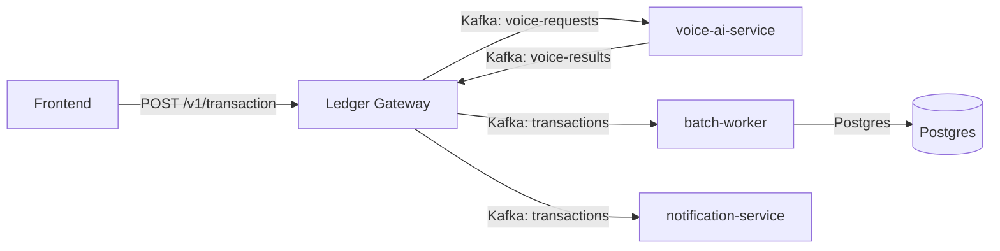

# Transaction Gateway Architecture

## Purpose
This change centralizes retail transaction processing behind a single transaction gateway endpoint. The frontend now sends all user transactions through `/v1/transaction`, and the service orchestrates voice parsing, ledger event production, and notification delivery.

## What changed
- Added a unified transaction request handler in `services/ledger-service/cmd/api/main.go`
- The transaction endpoint now accepts:
  - `user_id`
  - `amount` and `description` for direct transaction creation
  - `text` or `audio_base64` for voice-driven transaction parsing
- Added a resilient voice AI client in `services/ledger-service/internal/voice/client.go`
- Switched voice orchestration to Kafka for request/response through `voice-requests` and `voice-results`
- Added a Gemini circuit breaker inside `services/voice-ai-service/main.py` to protect the voice parsing dependency
- Updated the frontend in `client-vite/src/App.tsx` to call `/v1/transaction` directly instead of using `/voice/process` and manual ledger submission
- Kept Kafka-based notification and batch ledger ingestion unchanged, allowing them to remain decoupled and event-driven

## Why this is better
- **Single entrypoint for the client**: Frontend no longer chains voice and ledger flows manually
- **Enterprise-grade orchestration**: All transaction requests pass through the ledger gateway, which can be audited and controlled centrally
- **Resilient voice dependency**: Circuit breaker prevents repeated voice service failures from cascading into the transaction flow
- **Event-driven notifications**: Notification service remains a Kafka consumer of `transactions`, so clients never call it directly
- **Clear separation of concerns**: Voice parsing is still handled by `voice-ai-service`, while the gateway controls request routing and result validation

## Decision rationale
- The existing architecture already had a Kafka-backed ledger and notification pipeline, which is a strong basis for event-driven enterprise systems.
- The missing piece was a single transaction gateway that could absorb voice parsing, validate an AI-generated transaction, and emit the ledger event without exposing the client to multi-step wiring.
- A lightweight in-service circuit breaker protects the external voice service and preserves availability under failure.

## How the new flow works
1. Client posts to `/v1/transaction`
2. If the request contains `text` or `audio_base64`, the gateway publishes a `voice-requests` Kafka event.
3. `voice-ai-service` consumes the event, parses it with Gemini, and applies a circuit breaker around the external AI call.
4. `voice-ai-service` publishes the parsed result back to `voice-results`.
5. The gateway consumes the voice result and, if valid, publishes the transaction to Kafka.
5. `batch-worker` consumes Kafka and persists the transaction to Postgres
6. `notification-service` also consumes Kafka and sends notifications asynchronously

## Architecture diagram

## Kubernetes / k3d notes

- Manifests live in `deployments/k8s/`. The repo includes namespace, configMap, Traefik ingress, and per-service deployments.
- Quick k3d flow:
  1. `k3d cluster create vani-ledger`
  2. `make build-images` then `k3d image import <images> -c vani-ledger`
  3. `kubectl apply -R -f deployments/k8s/`
- For load testing in-cluster, see the k6 Job example in `README_DETAILED.md`.

## Reference

See the full runbook and diagrams in [README_DETAILED.md](README_DETAILED.md).

## Files changed
- `services/ledger-service/cmd/api/main.go`
- `services/ledger-service/internal/voice/client.go`
- `pkg/resilience/circuit_breaker.go`
- `client-vite/src/App.tsx`
- `docker-compose.yml`

## Result
This update makes the platform more maintainable, more enterprise-ready, and easier to operate. The frontend now has a single transaction contract, while the backend preserves resilient voice parsing and Kafka-based event delivery.
